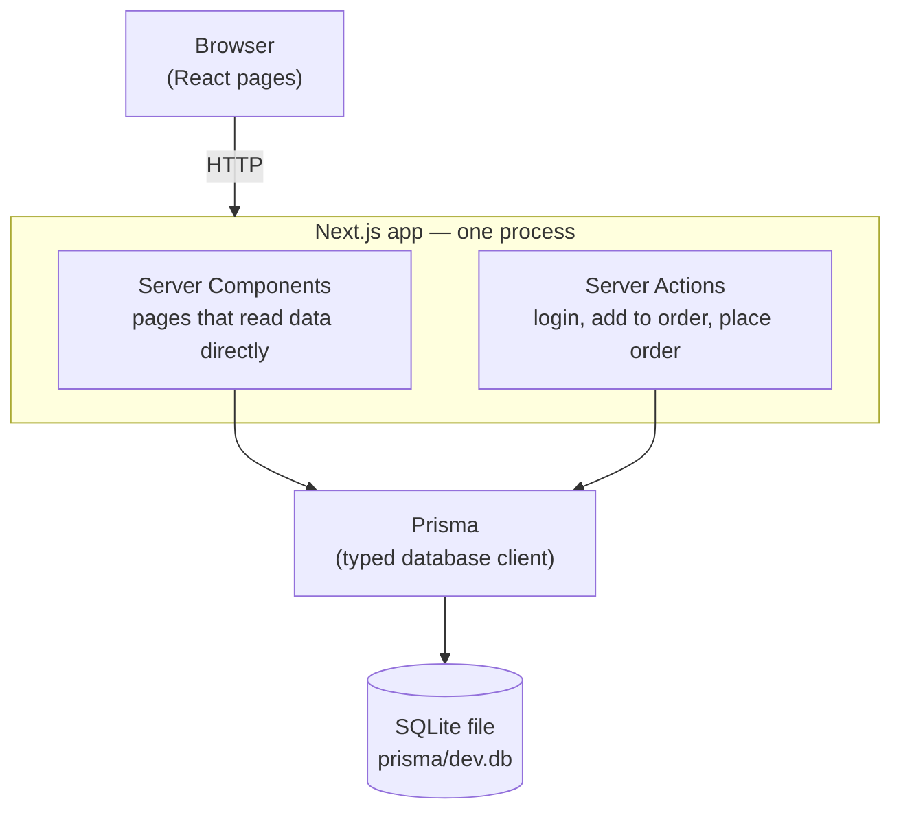
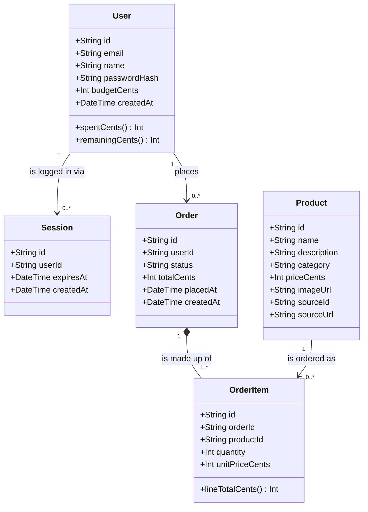

# Architecture — Furniture Buyer App

**Status:** Draft for Day 1 of hackathon · Last updated 2026-07-29
**Companion doc:** [requirements.md](requirements.md) — *what* the app does. This doc is *how*.

---

## 1. The shape of the whole thing

Everything is one Next.js project. There is no separate backend to start, and no
database server to install.



**Why one process matters for us:** the usual web-app setup is two programs (a
frontend and a backend API) that have to be started together, kept in sync, and
debugged separately. Next.js collapses that into one, so there is a single thing
to run and a single place a bug can be.

### How a page load actually works

1. Browser asks for `/catalogue`.
2. The page (a **Server Component**) runs *on the server*. Its first line is `requireUser()`, which reads the session cookie and looks it up: no valid session → redirect to `/login`, done.
3. Still on the server, the page queries the database through Prisma directly — no API call needed — and renders finished HTML.
4. Browser receives HTML that is already filled in with products and budget figures.
5. Clicking "Add to order" calls a **Server Action** — a normal-looking function that actually executes on the server, writes to the database, and refreshes the affected parts of the page.

The practical upshot: for most features there is *no API endpoint to write*. That
is where most of the day's time saving comes from.

## 2. Technology choices, and what was rejected

| Layer | Choice | Why this, over the alternatives |
| --- | --- | --- |
| Framework | **Next.js** (App Router) | Frontend + backend in one project, one language, one command to run. Alternatives: separate React + Express (two things to run, more glue code); plain HTML/PHP (less help available, weaker tooling). |
| Language | **TypeScript** | See ADR-1 below — this is a change from the first plan. |
| Database | **SQLite** | It's a single file (`prisma/dev.db`). Nothing to install, nothing to log into, and it can be deleted and reseeded in seconds. Alternatives: Postgres (needs a server or a cloud account — real friction on Day 1); a JSON file (no transactions, and we genuinely need one for budget safety). |
| Database access | **Prisma** | We describe the data once in `schema.prisma` and get a typed, autocompleting client plus **Prisma Studio**, a spreadsheet-like viewer for the data — the single most useful thing for a non-coder to see what's happening. |
| Login | **Own session cookie** (bcryptjs + session table) | See ADR-2 below — also a change from the first plan. |
| Styling | **Tailwind CSS** | Ships with Next.js's setup command, styling lives next to the markup so there's no hunting between files. Fast to iterate, which is what Day 1 rewards. |
| Money | **Integer cents** | See ADR-3. |
| Budget rule | **Swappable policy module** | See ADR-4. |
| Catalogue source | **One-way import from MongoDB** | See §7. The running app only ever reads SQLite. |

### How simple is this, really?

The app the browser talks to is **six dependencies**, plus one used only by the
catalogue import script:

| Package | What it's for |
| --- | --- |
| `next`, `react`, `react-dom` | the app itself |
| `typescript` | catches mistakes before the app runs (ADR-1) |
| `prisma` + `@prisma/client` | the database, and Prisma Studio for viewing it |
| `tailwindcss` | styling |
| `bcryptjs` | password hashing |
| `mongodb` *(dev only)* | reads the shop's catalogue once, during import (§7) |

Pinned versions worth knowing: **Prisma 6, not 7.** Prisma 7 requires a config
file, a `dotenv` dependency and a native `better-sqlite3` driver adapter to talk
to SQLite — three extra moving parts and a compiled module, for no benefit to
this app. **TypeScript 6, not 7**, because Next.js 16 needs a compiler API that
TypeScript 7 doesn't expose yet.

Everything else uses what's already built in: session tokens come from **Node's
own `crypto`** module, forms are **plain HTML forms** handled by Server Actions,
and there's no client-side data-fetching because pages read the database directly.

`bcryptjs` rather than `bcrypt` on purpose: `bcrypt` needs a C++ compilation step
that frequently fails on Windows/WSL, and `bcryptjs` is pure JavaScript that just
installs. Same algorithm, no build tools — exactly the kind of 40-minute detour
Day 1 can't afford.

**Deliberately not used**, though most tutorials would reach for them:

| Skipped | Why we don't need it |
| --- | --- |
| Redux / Zustand (state management) | The server holds the state; the cart is a database row, not browser memory |
| React Hook Form / Zod-heavy forms | Plain HTML forms + Server Actions cover every form here |
| shadcn/ui, MUI, Chakra (component kits) | There are ~6 components; Tailwind is faster than learning a kit |
| tRPC / REST API routes | Server Actions replace the entire API layer |
| Docker | SQLite + `npm run dev` needs no containers |
| A test framework | Day 1 is validated by using the app; see [risks](#8-known-risks) |

The rule we're holding ourselves to: **nothing gets added unless a Must-have in
[requirements.md](requirements.md) can't be built without it.**

### ADR-1 — TypeScript instead of JavaScript *(reversal)*

The first plan said JavaScript, reasoning that it's more beginner-friendly.
That reasoning was wrong for this project: **you are not reading or writing the
code — I am.** TypeScript's cost (extra type annotations) lands entirely on me,
while its benefit lands on you: it catches whole categories of mistake before the
app runs rather than during your demo. Prisma also generates TypeScript types
from the schema, so with TypeScript the database and the pages check each other
automatically. Next.js's setup command defaults to TypeScript too, so this is
also the path of least resistance.

### ADR-2 — A small hand-written session instead of NextAuth *(reversal)*

The first plan said NextAuth / Auth.js. I'm changing this. NextAuth is excellent
for "log in with Google/GitHub", but the **email + password** path (its
"Credentials provider") is the awkward corner of that library: it interacts badly
with the database adapter, it has changed shape between recent major versions, and
much of the guidance online applies to a version other than the one you install.
That is a bad thing to discover at 4pm.

Instead:

- Password is hashed with **bcryptjs** on the way in and compared on login. Plain-text passwords are never stored.
- On successful login the server generates a **long random token** (Node's built-in `crypto.randomBytes` — no library), stores it in a `Session` table, and sends it to the browser as an **HttpOnly cookie** (meaning page scripts cannot read it).
- Every request looks that token up to find the user. Log out deletes the row.

This is a well-trodden, textbook pattern — an opaque random token plus a database
lookup — and deliberately involves **no cryptography we have to get right** (no
signing keys, no JWTs, no token expiry maths). It's roughly 80 lines total, and
its behaviour is fully visible in Prisma Studio, which makes it debuggable rather
than magical.

*Honest caveat:* for a real product I'd revisit this — you'd want password reset,
brute-force protection, session expiry, and probably a managed provider like
Clerk or Auth.js with an OAuth provider. For a one-day demo with seeded accounts,
this is the right trade, and [requirements.md §6](requirements.md) states plainly
that we're not claiming production-grade security.

### ADR-3 — Store money as whole cents

`19.99` cannot be represented exactly by a computer's decimal numbers, so
arithmetic on prices drifts — this is how demos end up displaying `$1199.9800000001`
or a budget that's off by a cent after ten additions. We therefore store
`priceCents: 129900` (an integer) and format it as `$1,299.00` only at the moment
of display. Every total, budget, and comparison is integer arithmetic, so it is
exact.

### ADR-4 — The budget rule is a swappable module

We deliberately haven't hard-coded *what kind* of budget this is. Reduced to
essentials, any budget rule answers only two questions:

1. **How much is this buyer allocated?**
2. **Which of their placed orders count against that allocation?**

Answer those two differently and you get every variant: a one-off total (count
everything, ever), a monthly allowance (count only this calendar month), a
quarterly one, a per-category budget. So both answers live behind one small
interface in `lib/budget.ts`:

```ts
type BudgetPolicy = {
  label: string
  allocationCents: (user: User) => number
  /** Which placed orders count. null = unbounded in that direction. */
  currentPeriod: (now: Date) => { from: Date | null; to: Date | null }
  periodLabel: (now: Date) => string
}

const oneOffTotal: BudgetPolicy = { /* period: { from: null, to: null } */ }
const monthlyAllowance: BudgetPolicy = { /* period: start..end of this month */ }

// ─── The single line that changes the app's budget model ───
export const activePolicy = oneOffTotal
```

Everything else — the budget bar, the affordability badges, the
place-order transaction — goes through one function, `getBudgetSummary(userId)`,
which returns `{ totalCents, spentCents, remainingCents, periodLabel }`. **No page
or component ever knows which policy is active.** Switching to a monthly
allowance means editing one line and touching zero pages.

Shipping with `oneOffTotal` active: "you have $50,000, watch it go down" is the
clearest thing to show a judge in 90 seconds, and no date logic can misbehave on
stage. `monthlyAllowance` gets written at the same time and is a compelling thing
to *mention* — "and it's one line to switch" is a good answer to "could this handle
recurring budgets?"

## 3. Data model

The app needs to remember **five things**. Everything in
[requirements.md](requirements.md) can be built from these.



### In plain English

**User** — a buyer. Their email and a scrambled version of their password (so
nobody can read it, even with the database open), plus `budgetCents`: how much
they've been allocated to spend. This is the "Customer" of your example — we call
it `User` because it's also the thing that logs in, and requirements.md calls the
person a *Buyer*.

**Session** — proof that someone is currently logged in. When you log in
successfully, the app writes a row here and hands your browser a matching
ticket stub; every later page load presents the stub and the app looks it up to
know who you are. Logging out deletes the row. *(Requirement M1, M2.)*

**Product** — one piece of furniture in the catalogue: name, description,
category (`"Seating"`, `"Tables"`…), price, and a link to a photo. *(M3, and
`category` is what powers the filter in S4.)*

**Order** — one shopping trip. Its `status` is the important bit: `"DRAFT"` means
still being filled in, `"PLACED"` means committed. `totalCents` is the agreed
total, stamped in at the moment it's placed, and `placedAt` records when.
*(M4–M7.)*

**OrderItem** — one line on an order: *this product, this many, at this price*.
It exists because an order holds several products and each needs its own
quantity. *(M4, S3.)*

### How they connect

Reading the arrows as sentences:

- One **User** has many **Sessions** — one per device or browser they're logged in on.
- One **User** places many **Orders** — their current draft plus every past one.
- One **Order** is made up of one or more **OrderItems**. The filled-in diamond (`*--`) means the lines *belong* to the order: delete the order and its lines go with it, because a line has no meaning on its own.
- One **Product** shows up as many **OrderItems** — a sofa can appear on hundreds of orders. The plain arrow means the product is independent: deleting an order never touches the catalogue.

So the full path from a person to a price is:
`User → Order → OrderItem → Product`.

### What the model deliberately does *not* store

The italic methods in the diagram — `spentCents()`, `remainingCents()`,
`lineTotalCents()` — are **calculated on demand, never saved**. That's a
deliberate choice, and it's the single most common way an app like this goes
wrong.

If we stored a `remainingBudget` column, we'd have to remember to update it on
every order, cancellation, and correction — and the day we forget, or two things
update it at once, the number silently becomes a lie. Instead:

- `spentCents` = add up the buyer's PLACED orders (which ones count is the active budget policy's decision — [ADR-4](#adr-4--the-budget-rule-is-a-swappable-module))
- `remainingCents` = `budgetCents − spentCents`
- `lineTotalCents` = `quantity × unitPriceCents`

Derived from the orders themselves, these figures **cannot** disagree with
reality. There's one source of truth, and it's the orders. *(This is business rule
3 in [requirements.md §5](requirements.md).)*

The one exception is `Order.totalCents`, which *is* stored — because once an order
is placed, its total must be frozen history, not a live recalculation.

### Four decisions inside this model

- **The cart is just an `Order` with status `"DRAFT"`.** No separate Cart table, and no browser-only cart that vanishes on refresh (US-3 requires it to survive one). "Place order" becomes a status change rather than copying data from one table to another.
- **`unitPriceCents` is copied onto the line item** at the moment of adding. If the shop re-prices that sofa next week, last week's order still shows what was actually agreed. Without this, history rewrites itself — business rule 6.
- **`status` is plain text, not a formal list of options.** Prisma can't use database enums on SQLite, so `"DRAFT"` / `"PLACED"` are strings, with TypeScript restricting the allowed values in code. If we later move to Postgres (§6), this can become a real enum.
- **There is no `Budget` table.** A budget is a *rule*, not a record: "how much, and which orders count." Rules belong in code where they're swappable ([ADR-4](#adr-4--the-budget-rule-is-a-swappable-module)), so the only stored figure is `User.budgetCents`. If the shop ever needed a *different* allowance per month, that's when a `BudgetPeriod` table would earn its place — not before.

### Does it cover the requirements?

| Requirement | Covered by |
| --- | --- |
| M1, M2 — login, protected pages | `User.email` / `passwordHash`, `Session` |
| M3, M8 — catalogue, seeded demo data | `Product` |
| M4 — add items, set quantities | `Order` (DRAFT) + `OrderItem.quantity` |
| M5 — total / spent / remaining | `User.budgetCents` + derived `spentCents()` |
| M6 — reject over-budget orders | `Order.status`, `totalCents`, `placedAt` (see §4) |
| M7 — past orders with totals | `Order` where `status = "PLACED"` |
| S2 — mark unaffordable products | `Product.priceCents` vs derived `remainingCents()` |
| S3 — order detail, price paid | `OrderItem.unitPriceCents` |
| S4 — search and filter | `Product.name`, `Product.category` |
| C1 — cancel an order *(if we get to it)* | add `"CANCELLED"` to `status`; no schema change |
| C3 — spend by category *(if we get to it)* | `OrderItem → Product.category`; no schema change |

Both Could-haves need no new tables, which is a decent sign the shape is right.

### The schema itself

For reference — this is the above written as Prisma's schema language, which is
what actually creates the database:

```prisma
model User {
  id           String    @id @default(cuid())
  email        String    @unique
  name         String
  passwordHash String
  budgetCents  Int                    // total allocation, set at seed time
  orders       Order[]
  sessions     Session[]
  createdAt    DateTime  @default(now())
}

model Session {
  id        String   @id @default(cuid())   // the opaque token in the cookie
  userId    String
  user      User     @relation(fields: [userId], references: [id], onDelete: Cascade)
  expiresAt DateTime
  createdAt DateTime @default(now())
}

model Product {
  id            String      @id @default(cuid())
  name          String
  description   String
  category      String                      // "Beds", "Chairs", "Wardrobes", ...
  priceCents    Int
  imageUrl      String                      // a path or URL, never an image blob
  orderItems    OrderItem[]
  sourceId      String?                     // the shop's own product id (§7)
  sourceUrl     String?                     // link to the shop's product page
}

model Order {
  id         String      @id @default(cuid())
  userId     String
  user       User        @relation(fields: [userId], references: [id], onDelete: Cascade)
  status     String      @default("DRAFT")   // "DRAFT" = the cart | "PLACED"
  totalCents Int         @default(0)         // frozen when placed
  placedAt   DateTime?
  createdAt  DateTime    @default(now())
  items      OrderItem[]
}

model OrderItem {
  id             String  @id @default(cuid())
  orderId        String
  order          Order   @relation(fields: [orderId], references: [id], onDelete: Cascade)
  productId      String
  product        Product @relation(fields: [productId], references: [id])
  quantity       Int
  unitPriceCents Int                          // copied at add time — history must not change
  @@unique([orderId, productId])              // one line per product; re-adding bumps quantity
}
```

## 4. The one genuinely tricky bit: enforcing the budget

Getting this wrong is the most likely way this app embarrasses us on stage, so
it's worth being explicit.

A naive implementation reads the budget, checks it, then writes the order. Between
the check and the write, a second request — a double-clicked button, an
impatient refresh — can slip through, and the buyer overspends. Two orders each
pass the check; together they bust the budget.

So **placing an order happens inside one database transaction**:

```
begin transaction
  load the draft order and its line items (scoped to this user)
  if it has no items                     -> reject "Your order is empty"
  recompute total from the line items    -- never trust a total sent by the browser
  { remainingCents } = getBudgetSummary(userId)   -- asks the active policy (ADR-4)
  if total > remainingCents              -> reject, roll back, save nothing
  set status = PLACED, totalCents = total, placedAt = now
commit
```

Three rules fall out of that, and they apply everywhere:

1. **The server recomputes every total from the database.** A price or total arriving from the browser is treated as a suggestion, never a fact.
2. **The client-side "you can't afford this" warning is a courtesy, not a control.** The transaction above is the actual control.
3. **Placing is idempotent-ish by construction:** once the draft flips to `PLACED`, a second identical request finds no draft and does nothing.

## 5. Folder structure

```
my-furniture-buyer-app/
├── app/
│   ├── layout.tsx              # shared shell: nav + budget bar on every page
│   ├── page.tsx                # "/" -> redirects to catalogue or login
│   ├── login/page.tsx          # login form
│   ├── catalogue/page.tsx      # browse products, search, filter, paginate (US-2)
│   ├── order/page.tsx          # current draft order + Place Order (US-3, US-5)
│   ├── orders/
│   │   ├── page.tsx            # past placed orders (US-6)
│   │   └── [id]/page.tsx       # one order's line items (S3)
│   └── actions/                # Server Actions — the write operations
│       ├── auth.ts             # logIn, logOut
│       └── orders.ts           # addToOrder, changeQuantity, removeItem, placeOrder
├── components/
│   ├── Navbar.tsx
│   ├── BudgetBar.tsx           # total / spent / remaining (US-4)
│   ├── ProductCard.tsx
│   ├── LoginForm.tsx           # client component — shows login errors
│   ├── PlaceOrderButton.tsx    # client component — shows budget errors
│   └── Money.tsx               # the single place cents become "$1,299.00"
├── lib/
│   ├── db.ts                   # the one shared Prisma client
│   ├── session.ts              # createSession / getCurrentUser / requireUser
│   ├── budget.ts               # budget policies + getBudgetSummary() (ADR-4)
│   └── money.ts                # formatCents()
├── prisma/
│   ├── schema.prisma           # the data model above
│   ├── seed.ts                 # demo buyers + placeholder catalogue
│   ├── import-catalog.ts       # loads the real catalogue from MongoDB (§7)
│   └── dev.db                  # the database itself (git-ignored)
├── public/products/            # product images, written by the import (git-ignored)
├── .env                        # DATABASE_URL + CATALOG_MONGODB_URI (git-ignored)
├── requirements.md
├── architecture.md
├── CLAUDE.md
└── README.md
```

The guiding rule: **`app/` is pages you can visit, `components/` is things you
can see, `lib/` is logic shared between them.** If you're looking for where a
rule lives, it's in `lib/`.

**There is no `middleware.ts`.** The plan called for one, but the real guard is
`requireUser()` at the top of each protected page: a Server Component runs on the
server, so it cannot be bypassed from the browser. Middleware would only have
repeated the same redirect earlier, at the cost of another file and another
framework convention to track (Next.js 16 is mid-rename from `middleware.ts` to
`proxy.ts`). One guard, in one place, that can't be skipped.

## 6. Deployment

**Decided: the demo runs on your laptop** (requirements.md Q2). That's why SQLite
is the right fit — one file, no accounts, no network. `npm run dev` is the whole
deployment story for Day 1.

### If that changes later

If the hackathon later expects a **live URL** for judging, SQLite stops working: hosts
like Vercel run your app on machines with no permanent disk, so a file-based
database is wiped between requests. The fix is small *because* we're using Prisma:

1. Create a free hosted Postgres database (Neon or Supabase — a few minutes).
2. Change one line in `schema.prisma`: `provider = "sqlite"` → `"postgresql"`.
3. Point `DATABASE_URL` at the new database, re-run the migration and the seed.

To keep that swap cheap, this design deliberately avoids anything SQLite-specific
and stores product images as **URLs rather than uploaded files** — file uploads
are the other thing that breaks on disk-less hosting. So the escape hatch stays
open at roughly ten minutes' cost, without us paying anything for it today.

## 7. The catalogue import

The real product catalogue lives in the shop's MongoDB. `npm run db:import-catalog`
copies it into our SQLite database **once**; the running app never talks to
MongoDB. That keeps the app a single-database, single-process thing (§1) and means
a flaky network on demo day can't take the catalogue down.

```
MongoDB `catalog` collection  ──(npm run db:import-catalog)──▶  SQLite Product table
     762 documents                                                 + public/products/*.jpg
```

The connection string comes from `CATALOG_MONGODB_URI` in `.env`, which is
git-ignored. `.env.example` shows the shape with the credential removed.

### What the import has to fix along the way

The source data doesn't match our model, so the script translates. Each of these
is a decision worth knowing about:

| Source | Problem | What the import does |
| --- | --- | --- |
| `price: 51.6` | A decimal number of dollars, but we store integer cents (ADR-3) | `Math.round(price * 100)` → `5160`. Rounding matters: `51.6 * 100` is `5159.999…` in floating point — exactly the drift ADR-3 exists to prevent |
| `image_url` | Misleadingly named: it's ~73KB of **base64 image data**, not a URL (66MB across the catalogue) | Decodes each one to `public/products/<item_id>.jpg` and stores the short path. Keeping 66MB of base64 in the database would bloat every query and every page |
| no description field | `Product.description` is required | Builds one from colours and dimensions: `"Black · W80 × H105 cm"` |
| `product_name: "Bar stool"` | Generic — dozens of products share a name, so the grid would read as duplicates | Takes the series name from the product link (`/p/nordviken-bar-table-…`) to make `"Nordviken Bar table"` |
| no stable key | A re-import would have to delete and recreate rows, breaking the orders that point at them | Stores the shop's own `item_id` as `sourceId` and updates matching rows in place |

### Re-running it is safe

The script updates existing products rather than replacing them, so order history
keeps pointing at real products. It also **refuses to delete a product that a
placed order references** — history doesn't get deleted to tidy up a table. Draft
order lines are fair game, because a draft is work in progress.

### Two things to know

- **Prices are almost certainly not US dollars.** The source links point at IKEA Saudi Arabia, so the figures are most likely SAR, while the app formats them as `$`. Nothing is *wrong* in the arithmetic — every total and budget check is exact — but the currency symbol is cosmetic and probably mislabelled. It's a one-line fix in `lib/money.ts` (`CURRENCY = "SAR"`), and it's open question Q3 in [requirements.md §7](requirements.md).
- **`public/products/` is git-ignored** and recreated by the import. That's fine locally, but it's the second thing (after SQLite) that would break on disk-less hosting — see §6.

## 8. Known risks

| Risk | Mitigation |
| --- | --- |
| Auth eats hours (the classic Day 1 failure) | Own session (ADR-2), no library version churn. Build it first, behind a seeded login. |
| Demo data looks fake and undersells the app | Seed script with real furniture names, categories, and image URLs (M8) — treated as a Must, not a nice-to-have. |
| Budget logic has an off-by-one or a double-spend on stage | Integer cents (ADR-3) + single transaction (§4). Practise the double-click. |
| Scope creep into admin screens, payments, stock | Explicit "Won't have" list in [requirements.md §3](requirements.md). Set budgets and products by seeding. |
| Database in a weird state mid-demo | `npm run db:reset` restores a clean seeded state in seconds. |
