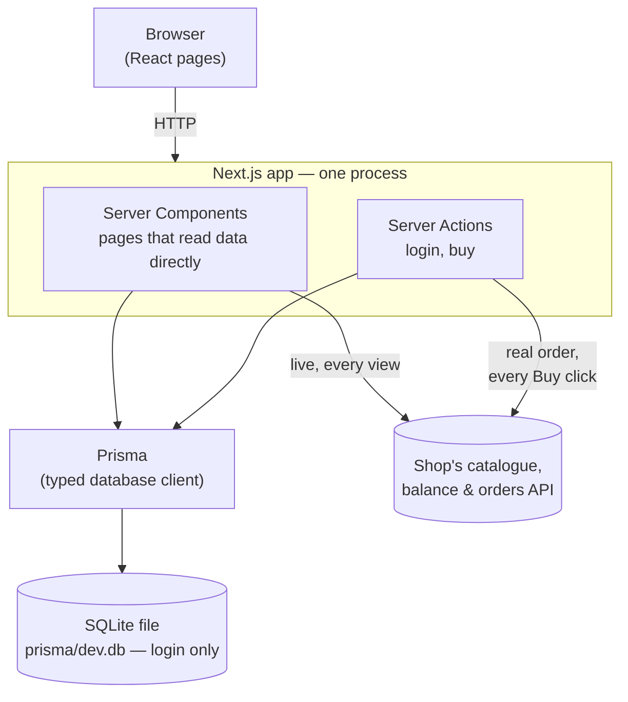
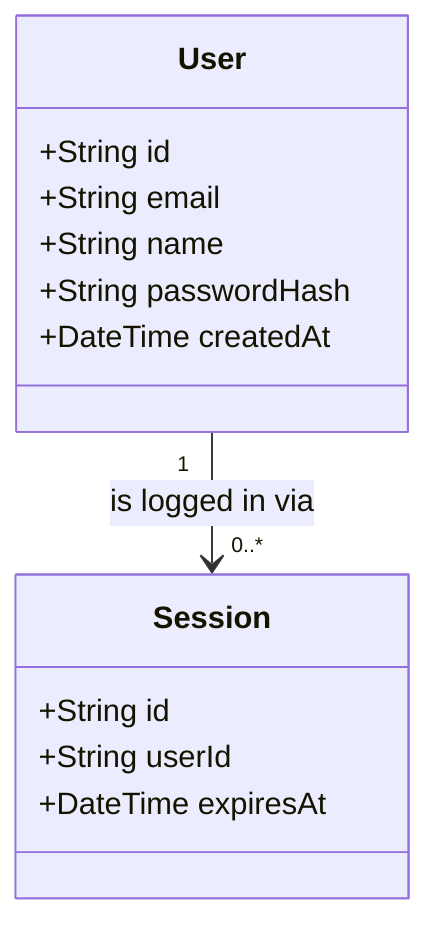

# Architecture — Furniture Buyer App

**Status:** Real integration with the furniture shop's own API · Last updated 2026-07-29
**Companion doc:** [requirements.md](requirements.md) — *what* the app does. This doc is *how*.

---

## 1. The shape of the whole thing

Everything is one Next.js project. There is no separate backend to start.



**What each database is actually for, since there are two now:** our own SQLite
file remembers exactly one thing — who's logged in (§3). Every product,
balance, and order is real data that belongs to the furniture shop, reached
live through their API (§7). This app never has its own copy of any of that.

**Why one process matters for us:** the usual web-app setup is two programs (a
frontend and a backend API) that have to be started together, kept in sync, and
debugged separately. Next.js collapses that into one, so there is a single thing
to run and a single place a bug can be.

### How a page load actually works

1. Browser asks for `/catalogue`.
2. The page (a **Server Component**) runs *on the server*. Its first line is `requireUser()`, which reads the session cookie and looks it up: no valid session → redirect to `/login`, done.
3. Still on the server, the page fetches the product list **live** from the shop's catalogue API and the real balance from the shop's balance API (§7) — real network calls, every view, no caching — and renders finished HTML.
4. Browser receives HTML that is already filled in with real products and the real balance.
5. Clicking **Buy** calls a **Server Action** that places a **real order** through the shop's API (§7) — genuinely, permanently, spending real balance — then redirects to a confirmation page showing the new balance.

**A note on where these calls actually happen:** every call to the shop's API
runs *on the server* — inside a Server Component or a Server Action — never in
the browser. That's required to keep the API key off the client (§2). One
consequence: **you will never see a request to the shop's API in your
browser's Network tab**, no matter how "live" this gets — only client-side
JavaScript fetches show up there. The catalogue page's "live · fetched
HH:MM:SS" label, and the `[cognitivo] GET ...` lines logged to the terminal
running `npm run dev`, are the two ways to actually see this happening.

## 2. Technology choices, and what was rejected

| Layer | Choice | Why this, over the alternatives |
| --- | --- | --- |
| Framework | **Next.js** (App Router) | Frontend + backend in one project, one language, one command to run. Alternatives: separate React + Express (two things to run, more glue code); plain HTML/PHP (less help available, weaker tooling). |
| Language | **TypeScript** | See ADR-1 — this is a change from the very first plan, still true today. |
| Login database | **SQLite** | It's a single file (`prisma/dev.db`). Nothing to install, nothing to log into. It only ever holds `User` and `Session` now (§3) — everything else is real data reached live from the shop's API. |
| Database access | **Prisma** | Typed, autocompleting client, plus **Prisma Studio** for viewing the two tables that remain. |
| Login | **Own session cookie** (bcryptjs + session table) | See ADR-2 — also unchanged. |
| Styling | **Tailwind CSS** | Ships with Next.js's setup command, styling lives next to the markup. |
| Money | **Integer cents** | See ADR-3 — unchanged, and now applied to real dollars from the shop's balance and order APIs too. |
| Products, balance, orders | **Live calls to the shop's own API — never stored locally** | See §7. This is the core of the current design (requirements 1–3): show what the shop actually says, spend what's actually there. |

### How simple is this, really?

The whole app is **six dependencies**: `next`, `react`, `react-dom`,
`typescript`, `prisma`+`@prisma/client`, `tailwindcss`, `bcryptjs`. Session
tokens use Node's built-in `crypto`; forms are plain HTML forms handled by
Server Actions; every call to the shop's API uses the built-in `fetch` — no
HTTP client library, ever.

Pinned versions worth knowing: **Prisma 6, not 7** (v7 needs a config file, a
`dotenv` dependency, and a native driver adapter for SQLite — no benefit here).
**TypeScript 6, not 7** (Next.js 16 rejects TypeScript 7's compiler API).

**Deliberately not used**, though most tutorials would reach for them: Redux /
Zustand (there's no client state to manage — every page reads live), a form
library (plain HTML forms + Server Actions cover the two forms this app has),
a component kit (Tailwind is faster for ~6 components), tRPC / REST routes
(Server Actions replace the API layer), Docker, a test framework (validated by
using the real app — see §8). The rule held throughout: **nothing gets added
unless a requirement genuinely can't be built without it.**

### ADR-1 — TypeScript instead of JavaScript *(reversal, still current)*

The first plan said JavaScript, reasoning that it's more beginner-friendly.
That reasoning was wrong for this project: **you are not reading or writing
the code — I am.** TypeScript's cost lands on me; its benefit — catching
mistakes before the app runs, rather than during a demo — lands on you.

### ADR-2 — A small hand-written session instead of NextAuth *(reversal, still current)*

NextAuth is excellent for "log in with Google," but the email+password path is
its awkward corner, with guidance online that often doesn't match the version
you'd install. Instead: bcryptjs hashes the password; the server generates a
random token (Node's `crypto.randomBytes`), stores it in a `Session` row, and
sends it as an HttpOnly cookie. No signing keys, no JWTs — an opaque token and
a database lookup, fully visible in Prisma Studio.

*Honest caveat, unchanged:* no password reset, no brute-force protection, no
session-expiry hardening. Not a claim of production-grade security.

### ADR-3 — Store money as whole cents *(unchanged)*

`19.99` isn't exact in floating point, so arithmetic on prices drifts. Every
amount — old local prices, and now the shop's real balance and order totals —
is converted to integer cents the moment it's read (`toCents()` in
`lib/cognitivo.ts`) and formatted back to currency only at display time
(`lib/money.ts`). This is why a $1.20 real purchase shows as exactly `$1.20`,
not `$1.1999999999999998`.

### ADR-4 — *(superseded)* the swappable local budget policy

An earlier version of this app tracked a **fictional** budget per demo buyer
in our own database — a one-off total or monthly allowance, swappable in one
line, enforced in a database transaction on every "place order." That code no
longer exists. It was removed, not just unused, when the owner asked to
replace the local simulation with the real thing (§7) — there is no longer a
concept of "our own budget" anywhere in this app. If you're reading old
commit history or an old copy of this file and see `lib/budget.ts` or a
`BudgetPolicy` type, that's what it was.

## 3. Data model

Two tables. That's all this app remembers on its own.



**User** — a buyer who can log in: email, a scrambled password, a name.
**Session** — proof of being logged in right now; a random token, looked up on
every request, deleted on logout.

That's it. No `Product`, `Order`, `OrderItem`, or `budgetCents` — those
existed in an earlier version and were deliberately dropped (not just
ignored) once every product, balance, and order became a live read from the
shop's API instead (§7). A local product/order table would have needed to be
kept in sync with the real thing and could drift out of date; not having one
at all means there's nothing to drift.

One real consequence worth naming: **every logged-in buyer in this app acts as
the exact same real shop account.** Our login system has two demo users (Sam,
Alex) so there's still something to log in *as*, but `COGNITIVO_USER_ID` in
`.env` names the one real account both of them act on — there's no per-buyer
balance or order history anymore, because the shop's API only knows about one
account for this API key.

## 4. The one genuinely tricky bit: knowing which failure is which

Placing a real order (`app/actions/orders.ts`, `buyNow`) can fail in ways that
matter differently to a buyer, and requirement 3 asks that each one gets its
own clear message rather than a generic error — and that none of them crash
the page.

```
buyNow(sourceId)
  → placeRealOrder(userId, sourceId, 1)   -- one real POST /orders call
      • HTTP 402 → InsufficientBalanceError  → "You don't have enough balance for this order."
      • HTTP 404 → ProductNotFoundError      → "This item is no longer available."
      • anything else (network blip, 5xx, an API change) → a generic message, logged server-side, never thrown to the page
```

The two specific status codes and their exact response shape
(`{"detail": "..."}`) were confirmed by **deliberately** sending two
requests designed to fail — a wildly over-quantity order (`402`) and a
nonexistent item (`404`) — against the real account, and checking its balance
was unaffected afterward. Written here so nobody has to rediscover it by
reading an undocumented `422`-only OpenAPI spec:

| Failure | HTTP status | Response body |
| --- | --- | --- |
| Insufficient balance | `402 Payment Required` | `{"detail": "Balance X.0 is less than total price Y.0"}` |
| Item doesn't exist | `404 Not Found` | `{"detail": "No product with item_id '...'"}` |

`InsufficientBalanceError` and `ProductNotFoundError` in `lib/cognitivo.ts`
turn those two specific cases into typed errors; `buyNow`'s `catch` block maps
each to its own message and anything unrecognized to a safe fallback — never
an unhandled exception reaching the page. The same "catch it, show a message,
never crash" rule is applied everywhere else this app calls the shop's API:
the catalogue page if `/catalogue/search-index` is unreachable, the balance
bar in the layout if `/users/{id}` is unreachable, the order pages if
`/orders/{id}` is unreachable.

## 5. Folder structure

```
my-furniture-buyer-app/
├── app/
│   ├── layout.tsx              # nav + real balance bar on every page (requirement 1)
│   ├── page.tsx                # "/" -> redirects to catalogue or login
│   ├── login/page.tsx          # login form
│   ├── catalogue/page.tsx      # live products, search, filter, paginate, Buy (requirement 2)
│   ├── orders/
│   │   ├── page.tsx            # real order history, live from the shop's API
│   │   └── [id]/page.tsx       # one real order's detail + post-purchase confirmation
│   └── actions/
│       ├── auth.ts             # logIn, logOut
│       └── orders.ts           # buyNow — the one action that places a real order
├── components/
│   ├── Navbar.tsx
│   ├── BalanceBar.tsx          # the real balance, every page (requirement 1)
│   ├── ProductCard.tsx
│   ├── BuyButton.tsx           # client component — shows the friendly error inline (requirement 3)
│   ├── LoginForm.tsx           # client component — shows login errors
│   └── Money.tsx               # the single place cents become "$1,299.00"
├── lib/
│   ├── db.ts                   # the one shared Prisma client (login only)
│   ├── session.ts              # createSession / getCurrentUser / requireUser
│   ├── money.ts                # formatCents()
│   └── cognitivo.ts            # everything that talks to the shop's API — see §7
├── prisma/
│   ├── schema.prisma           # User + Session, nothing else (§3)
│   ├── seed.ts                 # demo logins only
│   └── dev.db                  # the database itself (git-ignored)
├── public/products/            # leftover photos from an earlier version — see §7 (git-ignored)
├── .env                        # DATABASE_URL, COGNITIVO_API_BASE_URL/KEY/USER_ID (git-ignored)
├── requirements.md
├── architecture.md
├── CLAUDE.md
└── README.md
```

**There is no `middleware.ts`.** `requireUser()` at the top of each protected
page is the real guard — a Server Component runs on the server, so it can't
be bypassed from the browser.

## 6. Deployment

The demo runs **on the laptop only** (requirements.md Q2). SQLite is still the
right fit for the one thing it stores — login — since that part of the app
has no reason to depend on a network. The catalogue, balance, and orders
pages, by contrast, are now only as available as the shop's API is — see the
tradeoff in §7 and the risk table in §8.

If this ever needed a public URL: swapping SQLite for hosted Postgres (one
line in `schema.prisma`) is unaffected by anything in this section, since the
shop-API integration doesn't touch the database at all.

## 7. The real integration *(the core of this version)*

This app used to simulate a budget: a fictional number per demo buyer, spent
against local orders, entirely made up. The owner explicitly asked to replace
that with the real thing — the furniture shop's own catalogue, balance, and
orders API (`day1.training.cognitivo.com.au`, documented in the Day 1
Participant Guide) — so that what the app shows and what it does are both
genuine. `lib/cognitivo.ts` is the one place every call to that API is made.

```
GET /catalogue/search-index   → the catalogue page, live, every view, no caching
GET /users/{user_id}          → the balance bar, live, every view (requirement 1)
POST /orders                  → buyNow, one real order per click (requirement 2)
GET /orders/{user_id}         → the order history pages
```

### Why `/catalogue/search-index`, not `/catalogue`

The API exposes the same 762 products two ways: `GET /catalogue` returns full
records **with embedded images** (measured: 500 products, **7.0s**, 57MB);
`GET /catalogue/search-index` returns the same fields **without images**
(measured: 500 products, anywhere from **0.6s to 3.0s** at different times —
confirmed via a direct `curl` outside the app, so the swing is the shop's
server, not anything here). Always at least 2× faster and 375× smaller. This
app calls `/catalogue/search-index` only, paging through with `skip`/`limit`
(capped at 1000 per call) so a catalogue that grows past 1000 products can't
silently get truncated.

### The one real account

```
GET /users/cognitivo020 → {"user_id":"cognitivo020","name":"kaushik.vikash96@gmail.com","balance":4804.0}
```

This API key resolves to exactly **one** real account. There is no way, with
what this key can see, to have "Sam's balance" and "Alex's balance" be
different real things — so both demo logins act on the same account,
`COGNITIVO_USER_ID` in `.env`. That's a deliberate simplification the owner
chose, not a limitation discovered late: see requirements.md.

### What placing a real order actually requires

`POST /orders` wants `{"user_id": "...", "items": [{"item_id": "...",
"quantity": 1}]}` and returns `{order_id, status, items[], total_price,
remaining_balance}` on success — exactly what "confirmation and updated
balance" (requirement 2) needs, with no extra call. `buyNow` always orders
quantity 1 of one item per click — there's no cart, because none was asked
for; "click Buy, get one of that, right now" is the entire interaction.

### What happened to product photos

The live endpoint never returns an image (that's what makes it fast). An
earlier version of this app ran a one-time import that saved 762 photos to
`public/products/`. Those files are still there, still named by the shop's own
`item_id` — so the catalogue page reads that folder once per view (a single
`readdir`, not 762 file checks) and shows a photo wherever one happens to
exist, purely for display. Nothing writes to that folder anymore, and nothing
depends on it being there — a fresh checkout with an empty `public/products/`
still works, every card just shows the gradient tile instead of a photo.

### The honest tradeoff

**The catalogue, balance, and order pages now depend on a third party's
server being reachable, live, whenever anyone uses the app.** If it's down,
slow, or having a bad moment, that's what a user sees. Requirement 3's
"don't crash the page" rule is the mitigation *within* that dependency — every
call is wrapped so a failure becomes a clear message, never a `500` — but
there's no mitigation *for* the dependency itself; unlike the old local
simulation, there's no local fallback anymore, because the entire point of
this version was to stop pretending.

### The other thing this account can do that this app doesn't touch

The shop's API also has `/webhooks` and `/claim` endpoints, and a
`/games/chess/win` endpoint, unrelated to anything in this app's three
requirements. Not called anywhere here — noted only so nobody assumes
`lib/cognitivo.ts` is a complete client for the whole API. It's a complete
client for exactly the four calls listed above.

## 8. Known risks

| Risk | Mitigation |
| --- | --- |
| Auth eats hours (the classic Day 1 failure) | Own session (ADR-2), unaffected by this rewrite. |
| Shop's API is slow/down while someone's using the app | Every call is try/caught; a failure shows a clear message, never a crash (§4, §7). There's no local fallback anymore — see the honest tradeoff above. |
| A real order gets placed by mistake (testing, a demo click) | There's no undo. `buyNow` always orders quantity 1, so the worst case of a stray click is one cheap item, not a large accidental spend — but it is still real. Be deliberate clicking Buy. |
| Confusion about "whose balance is this" | Documented plainly (§7): every login acts on the one real account, `cognitivo020`. Not per-buyer. |
| Database in a weird state | `npm run db:reset` restores clean demo logins in seconds — it only ever touches login data now, never anything real. |
